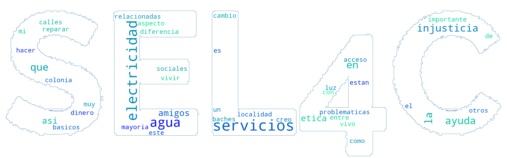

# azure-functions

## Running it

### Word Cloud

<details close>
<summary>Expand</summary>
To run the word cloud function you can do it locally using VS Code or deploy it to Azure.
- I do recommend to already have a Postgres database running on Azure with all requirements set up (see below). And to insert a row in the word_cloud_text table with the text found in samples/**db_text.txt** representing the existing previous reponse of more users.

Then execute a web request to the function endpoint as follows:
:Exclamation: :Exclamation: :Exclamation: Be sure to modify the uri and textFilePath according to your environment. :Exclamation: :Exclamation: :Exclamation:

```powershell
# URI of the function & path to the text file (user response)
$uri = "https://<your_function_app_name>.azurewebsites.net/api/wordcloud"
$textFilePath = "C:\azure-functions\samples\text.txt"

# Create a multi-part form data content
$boundary = [System.Guid]::NewGuid().ToString()
$header = @{
    "Content-Type" = "multipart/form-data; boundary=$boundary"
}

$CRLF = "`r`n"
$body = "--$boundary$CRLF"
$body += "Content-Disposition: form-data; name=`"text`"; filename=`"text.txt`"$CRLF"
$body += "Content-Type: text/plain$CRLF$CRLF"
$body += Get-Content -Path $textFilePath -Raw
$body += "$CRLF--$boundary--$CRLF"

# Send the POST request with the text file
$response = Invoke-RestMethod -Uri $uri -Method Post -Headers $header -Body $body
$response
```

```bash
curl -X POST -H "Content-Type: multipart/form-data; boundary=<your_boundary>" \
     -F "text=@/path/to/text.txt" \
     https://<your_function_app_name>.azurewebsites.net/wordcloud
```
- I don't have Mac so I couldn't test the curl command. If you have any issues please let me know.

This is an example output


:exclamation: :exclamation: :exclamation: As for now, the function takes around 4 seconds to process a request with a similar text input such as the sample provided, using larger texts around 100k words takes around 20 seconds. :exclamation: :exclamation: :exclamation:

</details>

## Deploying to Azure

### Word Cloud

<details close>
<summary>Expand</summary>
To deploy the word cloud function to Azure I recommend using VS Code.

:exclamation: Be sure to already haev the postgresql database deployed and to modify the connection string according to your environment. _function_app.py Line 30_ :exclamation:

1. Install the Azure Tools extension for VS Code; Azurite (Azure Storage Emulator) extension is recommende; [Azure Functions Core Tools](https://learn.microsoft.com/en-us/azure/azure-functions/functions-run-local); [PostgreSQL](https://www.postgresql.org/download/) isn't required but recommended for connecting to the DB through pgAdmin.
2. Sign in to Azure using the Azure: Sign In command.
3. Create a new foler on root to contain the function app.
4. Create a virtual environment in the folder you just created.
``` python
python -m venv .venv
```
5. Go to the Azure tab and click on Create Function... option on the Functions button.
6. Select the folder you just created 3 steps above.
7. Select Python (Programming Model V2) as the language.
8. Select the virtual environment you just created if prompted.
9. Select HTTP trigger as the template. Write the name of the function and select anonymous as the authorization level.
10. Copy and paste the files from word_cloud folder to the folder you just created.
11. Run the function locally by starting Azurite though the command palette: **F1** + _Azurite: Start_, then pressing **f5** and ensuring correct functionality.
12. Create a new Function App on Azure through the Resources tab at the Azure extension tab, or use the Azure portal.
    - You must:
        - Select an active subscription.
        - Create a new resource group or use an existing one.
        - Select the python runtime stack.
        - Select the region you want to deploy the function app.
13. Go to the Workspace tab at the Azure extension tab and click on Deploy to Function App on the Functions button.

:question: :question: :question: If you have any issues deploying the function you can look at the following [tutorial](https://learn.microsoft.com/en-us/azure/azure-functions/create-first-function-vs-code-python?pivots=python-mode-configuration). :question: :question: :question:

:exclamation: :exclamation: :exclamation: If there is any other issue, the ones I had were related to networking allowed IP addresses and postgresql python packages. :exclamation: :exclamation: :exclamation:

</details>

## Requirements

### Word Cloud

<details close>
<summary>Expand</summary>
A Postgres database running on Azure. With a db named **sel4c**, a table named 'word_cloud_images' with two columns: 'id' (integer, serial) and 'image' (bytea).
- Create another user than admin to keep security tight. Then add the required permissions to the user such as SELECT and INSERT on the wordcloud table.

```SQL
-- Create the wordcloud table
CREATE TABLE word_cloud_images (
    id SERIAL PRIMARY KEY,
    image_data BYTEA
);
-- Grant SELECT & INSERT permission on the tables word_cloud_image & word_cloud_text to your_user_name
GRANT SELECT, INSERT, UPDATE ON word_cloud_images TO your_user_name;
GRANT SELECT, INSERT, UPDATE ON word_cloud_text TO your_user_name;
COMMIT;
```

Be sure to check the network settings of your database to allow access from the Azure Function App. You can do this by adding the IP of the Function App to the firewall rules of the database or the option "Allow public access from any Azure service within Azure to this server".

:exclamation: :exclamation: :exclamation: Both functions are developed for azure functions python v2 :exclamation: :exclamation: :exclamation:
